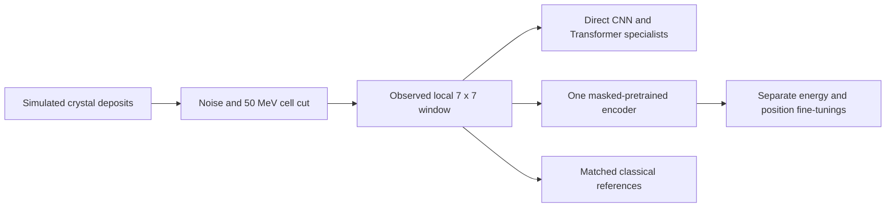

# CaloLab Reco

Reconstruct a photon's energy and impact position from simulated calorimeter crystals. Compare small CNNs and Transformers, then test whether one masked-pretrained encoder helps when fine-tuned separately for the two tasks.

**Main finding:** pretraining improves position reconstruction under the assumed noisy measurement conditions. Energy gains are less consistent, and a strong classical calibration remains better on average.

## Explore the study

| Read | What you will learn |
| --- | --- |
| [1. Data](notebooks/01_data_audit.ipynb) | From an incident photon to crystal deposits, labels and a numerical representation |
| [2. Methods and decisions](notebooks/02_methods_and_decisions.ipynb) | What failed initially, which experiments changed the approach, and why the final method was selected |
| [3. Final results](notebooks/04_final_results.ipynb) | Accuracy, the benefit and cost of pretraining, and physical limitations |

For the written rationale, see the [decision record](docs/decisions.md). Installation, tests, Docker and optional GPU training are grouped in [Reproduce the study](docs/reproduce.md).

## Approach

Each downstream model specializes in energy or position. Networks receive the same measured deposits and geometry as the references, without a calibrated physical prediction as input. Pretraining reconstructs masked measured cells; it does not reconstruct an unavailable noise-free detector measurement.

## Results on held-out events

The main condition uses noise plus a 50 MeV cell cut on **5,935 previously reserved events**. Model selection uses validation only; settings, references and weights were frozen before test evaluation. Neural entries are means of three separately trained models' scores, not an ensemble.

| Estimator | Energy MARE (%) | Median position error |
| --- | ---: | ---: |
| Affine energy / periodic barycenter | 3.717 | 0.09576 |
| Quadratic energy calibration | **2.104** | n/a |
| Local CNN specialists | 4.188 | 0.10577 |
| Local Transformer specialists | 2.554 | 0.07040 |
| Shared pretraining, separate fine-tunings | 2.389 | **0.04643** |

Lower is better. Energy MARE is mean absolute relative error; position uses stored coordinate units, not centimeters.

- **Position:** pretraining reduces the mean of the three position medians by 34.1% against the direct Transformer and 51.5% against the periodic reference. All three paired runs improve; one weak direct run contributes substantially to the mean gain.
- **Energy:** the mean improves against direct training, but only one of three paired runs improves. The quadratic reference remains stronger on average.
- **Cost:** position fine-tuning reaches the direct model's validation target in 2.03 active minutes versus 4.01 on average, with 7.21 minutes of additional pretraining. These are retrospective target crossings; all runs completed their full training schedules, so actual early-stopping savings were not demonstrated. The two studied tasks do not amortize pretraining.

Individual seeds, controls, error tails and the conditional reuse calculation are collected in the [final report](reports/final/README.md).

## Data and limits

The [public Maidannyk and Sahin dataset](https://zenodo.org/records/18929909), licensed CC BY 4.0, contains simulated photons in a CMS-inspired crystal calorimeter. We retain 40,000 events: 28,118 train, 5,947 validation and 5,935 test. The original grid has 30 x 85 crystals; the selected method uses a 7 x 7 window around the measured maximum. Scales and classical calibrations are fitted on train only.

This is a simplified detector-response study, not collision data or an exact reproduction of CaloFound. Noise worsens absolute reconstruction but gives learned position estimators an advantage over the matched reference. A noise maximum can select the wrong window: seven primary test events fail badly and remain in the scores. The median improvement does not remove these rare errors. One detector, two tasks and three training seeds do not establish a universal foundation model or real-detector transfer.
