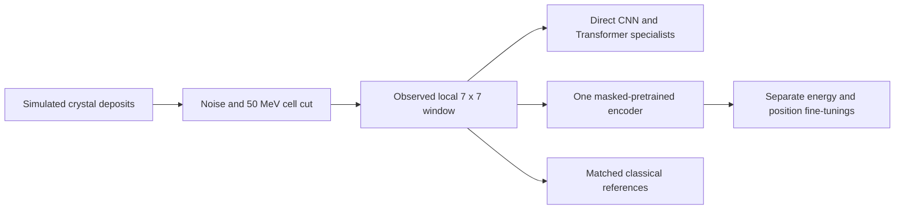

# CaloLab Reco

Reconstruct a photon's energy and impact position from simulated calorimeter crystals. Compare small CNNs and Transformers, then test whether one masked-pretrained encoder helps when fine-tuned separately for the two tasks.

**Main finding:** pretraining improves typical position accuracy under the assumed noisy measurement conditions, but does not reduce the rare large errors or improve position RMSE against the reference. Energy gains depend on the metric, and a strong classical calibration remains better on average.

## Explore the study

| Read | What you will learn |
| --- | --- |
| [1. Data](notebooks/01_data_audit.ipynb) | From an incident photon to crystal deposits, labels and a numerical representation |
| [2. Methods and decisions](notebooks/02_methods_and_decisions.ipynb) | What failed initially, which experiments changed the approach, and why the final method was selected |
| [3. Final results](notebooks/04_final_results.ipynb) | Accuracy, the benefit and cost of pretraining, and physical limitations |

For the written rationale, see the [decision record](docs/decisions.md). Installation, tests, Docker and optional GPU training are grouped in [Reproduce the study](docs/reproduce.md). The Docker section provides a downloadable archive with the required data and checkpoints.

## Approach

Each downstream model specializes in energy or position. Networks receive the same measured deposits and geometry as the references, without a calibrated physical prediction as input. Pretraining reconstructs masked measured cells; it does not reconstruct an unavailable noise-free detector measurement.

## Results on held-out events

The main condition uses noise plus a 50 MeV cell cut on **5,935 previously reserved events**. Model selection uses validation only; settings, references and weights were frozen before test evaluation. Neural entries are means of three separately trained models' scores, not an ensemble.

| Estimator | Energy MARE (%) | Position median | Position RMSE |
| --- | ---: | ---: | ---: |
| Affine energy / periodic barycenter | 3.717 | 0.09576 | **0.92311** |
| Quadratic energy calibration | **2.104** | n/a | n/a |
| Local CNN specialists | 4.188 | 0.10577 | 0.93405 |
| Local Transformer specialists | 2.554 | 0.07040 | 0.92632 |
| Shared pretraining, separate fine-tunings | 2.389 | **0.04643** | 0.93053 |

Lower is better. Energy MARE averages the absolute percentage error across events. Position uses distances in stored coordinate units, not centimeters: the median describes a typical error, while RMSE gives more weight to large errors. These metrics were fixed before test evaluation. Each neural score is averaged across three training runs.

Seven of the 5,935 events have a window misplaced by noise, causing very large position errors. They remain in the scores: the networks improve the median, but these failures erase the advantage when measured by RMSE.

- **Position:** pretraining lowers the median error in all three runs, by 34.1% on average versus direct training. One weak direct run makes this average gain larger. RMSE remains slightly worse than the physical reference.
- **Energy:** pretraining improves the mean error in only one of three runs. A supplementary analysis after the test shows a median-error improvement in all three (1.454% to 1.261% on average). The quadratic calibration remains better on both measures, with a 1.115% median error. The originally selected metric remains mean error.
- **Training time:** position fine-tuning reaches the comparison accuracy sooner (2.03 vs 4.01 minutes), with 7.21 minutes of pretraining beforehand. All runs continued to their full budget, so actual compute savings were not demonstrated; the two tasks do not pay back pretraining.

Individual seeds, controls, error tails and the conditional reuse calculation are collected in the [final report](reports/final/README.md).

## Data and limits

The [public Maidannyk and Sahin dataset](https://zenodo.org/records/18929909), licensed CC BY 4.0, contains simulated photons in a CMS-inspired crystal calorimeter. We retain 40,000 events: 28,118 train, 5,947 validation and 5,935 test. The original grid has 30 x 85 crystals; the selected method uses a 7 x 7 window around the measured maximum. Scales and classical calibrations are fitted on train only.

This is an independent study on simulated detector deposits, not measurements from real collisions or a reproduction of existing work. [DeepCluster](https://link.springer.com/article/10.1140/epjc/s10052-024-12978-1) and [ClusTEX](https://arxiv.org/html/2603.18172v2) informed the local reconstruction and simplified noise/threshold choices. The [CaloFound presentation](https://indico.cern.ch/event/1655754/contributions/7178905/attachments/3338097/5981814/CaloFound_Mode.pdf), which explores reusable calorimeter representations, motivated the shared-pretraining question. Our architectures, references and bounded one-photon protocol differ from those works.

## Possible next steps

1. **Select the observed region more reliably.** Compare several candidate windows or an adaptive window, with a full-grid fallback when localization is uncertain. Prioritize the low-energy cases where noise can move the maximum away from the shower, and measure large-error counts as well as typical accuracy.
2. **Strengthen detector realism.** Validate the noise and threshold assumptions against detector documentation and, ideally, calorimetry expertise. The current simplified response is not a validated model of the full CMS readout.
3. **Compare reconstruction formulations fairly.** Compare full-grid inputs, local windows and learned corrections to a physical reference with matched information and comparable training/tuning budgets. Separate representation effects from architecture changes wherever possible.
4. **Consolidate model comparisons.** Explore architecture and hyperparameter choices within a declared budget, then repeat with more independent training seeds.
5. **Deepen the compute-cost comparison.** Compare direct training and fine-tuning at comparable accuracy, then estimate how many useful downstream tasks would repay the shared pretraining cost.
6. **Scale data and compute.** Test whether larger training samples and greater compute budgets improve accuracy and the benefit of pretraining.
