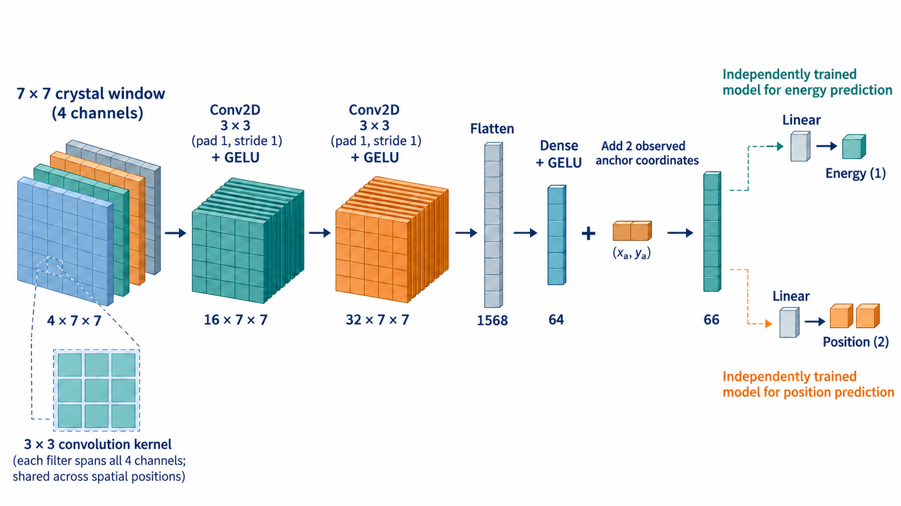
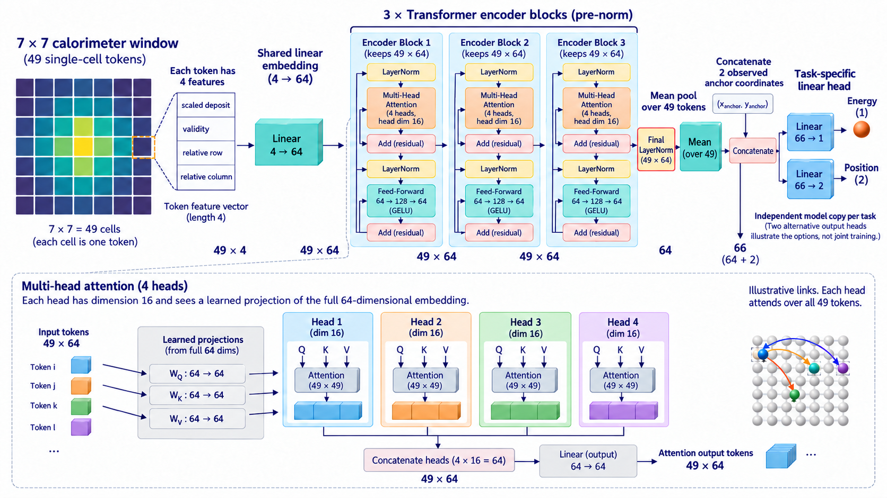

# Selected reconstruction protocol

This is the exact method used for the completed study. Read [methods and decisions](../notebooks/02_methods_and_decisions.ipynb) for the explanation, [decisions](decisions.md) for the rationale, and the [final report](../reports/final/README.md) for measured outcomes. [Reproduction](reproduce.md) contains installation and execution commands. Training settings and the evaluation freeze remain in configs/confirmation.json and configs/final_evaluation.json.

## Data and measurements

Use the fixed 40,000-event sampling: 28,118 train, 5,947 validation and 5,935 test events held out until final evaluation. The GPU exchange bundle contains train and validation only. Keep all selected train labels, including low-energy events. Verify source IDs, finite values, shapes and archive fingerprints before execution.

Convert stored MeV deposits to GeV for the readout model. Independently per cell, add a zero-mean Gaussian fluctuation with

`variance = 0.03^2 * E + (0.0035 * E)^2 + 0.167^2`, with `E` in GeV.

Then set measured cell values below 0.05 GeV to zero. This is a simplified measurement response, not full digitization. Use a fixed training-noise draw, a different fixed validation draw, and two additional validation draws for robustness. Noise strength is not tuned. Clean and signed-noise-only controls use the same photons and the same noise draws where applicable.

The local window is 7 x 7 around the measured maximum. Supply deposits, an edge validity channel, relative indices and the observed anchor. Invalid edge cells are padded with zero and marked invalid. The original full grid chooses the anchor; true impact coordinates never choose it.

Divide deposits by one train-only scale: the 95th percentile of the maximum clean deposit per training event. Preserve absolute amplitude; no per-event normalization and no division by an incident truth. Targets use train means and standard deviations for output parameterization. Local position is predicted as an offset from the observed anchor, then converted back to stored coordinates.

## Models and objectives

| Component | Fixed choice |
| --- | --- |
| CNN | Two 3 x 3 convolutions, 16/32 channels; flatten; width 64; task head receives the observed anchor |
| Transformer | 49 cell tokens; four input values per token: deposit, validity, relative row/column; linear embedding to 64; three blocks; four heads; mean pooling and observed anchor |
| Energy objective | Huber of `(prediction - truth) / (0.1 * truth)`, delta 1 |
| Position objective | Mean coordinate Huber of `prediction - truth`, delta 1 stored coordinate unit |
| Task sharing | Independent downstream models for energy and position; task weight one |
| Optimization | AdamW, learning rate 3e-4, weight decay 1e-4; cosine schedule; 4,400 updates; effective batch 128, microbatch 32 |
| Selection | Lowest validation energy MARE or position median, evaluated every 220 updates; earlier checkpoint wins ties |

Schematic of the selected CNN. Four channels describe each cell; the convolutions operate over the two spatial dimensions. The 64-value representation is joined to the observed anchor before the task head.

Schematic of the selected Transformer. Each crystal is a token with four input values; attention exchanges information across 49 tokens before mean pooling. Energy and position use independent downstream models with this same architecture.

The unused task head remains allocated for exact architecture continuity but receives no task gradient. Report allocated and active parameters separately. No physical calibration output enters a neural prediction.

The energy objective gives a comparable penalty to comparable fractional errors across energies. Huber limits the influence of very large errors. The factor 0.1 sets its transition at a 10% relative error; it is not a measured detector resolution. For position the transition is one stored coordinate unit. These fixed scales were carried forward from the exploratory specialist studies, not newly tuned.

## One pretraining, two fine-tunings

For each training seed, pretrain one shared local Transformer embedding and encoder on **train measured inputs only**. Reconstruct the measured deposits, not unavailable clean targets. Use a temporary width-32, two-block Transformer decoder. The encoder has the same architecture as the direct Transformer.

Mask 50% of valid cell tokens. A fixed train-only audit lowers this to 25% if more than 10% of sampled masks hide all positive measured values. This diagnostic concerns measured positives, which may include noise. Its result is recorded. Masked deposit values are removed before embedding; a learned mask vector separates a hidden cell from a measured zero. Geometry and validity remain known. Invalid padding is never a reconstruction target.

Use squared reconstruction error only on masked valid cells, with equal weight for positive values and measured zeros, calculated across the effective batch. If one group is absent, use the available group. This study uses masked tokens inside the encoder; it is a small masked-reconstruction model, not an exact implementation of the original visible-token-only MAE architecture.

Pretrain for 4,400 updates, retaining the last checkpoint without downstream validation selection. Transfer embedding and encoder only into two fresh supervised models. Fine-tune all encoder weights separately for energy and position. Direct and fine-tuned models use identical fresh heads for a given seed, the same sample order, losses, schedule and supervised update ceiling. The decoder and mask token are discarded.

## References and execution matrix

All references use the same observed local window and train-only fitting:

- Affine energy calibration of the measured sum.
- Periodic position calibration of the measured barycenter, with three fixed harmonics.
- Degree-two energy calibration of seven measured features, fitted by SVD relative least squares with no ridge. This freezes the post-hoc diagnostic from the earlier review for the next comparison.

| Condition | Training seeds | New phases |
| --- | ---: | ---: |
| Noise + cut | 3 | 6 CNN specialists, 6 direct Transformer specialists, 3 shared pretrainings, 6 fine-tunings |
| Clean | 1 | 2 CNN specialists, 2 direct Transformer specialists |
| Noise only | 1 | 2 CNN specialists, 2 direct Transformer specialists |
| Total | | 29 phases, including 3 pretrainings |

Previous results are context, not reused as new confirmation replicates. Seeds vary initialization and sample order; measurement noise is held fixed. Every main-condition seed has its own shared pretrained encoder, never one encoder pretrained separately for energy and another for position.

## Evaluation and compute accounting

Report energy MARE, MAE, bias and robust resolution; position median, 68th, 95th and 99th percentiles, coordinate biases and large-error fractions. Keep all energy/index-region subgroups and report empty ones. Compare validation curves against active training time. Show individual training seeds; do not confuse three seeds with event-bootstrap intervals or a general architecture ranking. The main table averages the three individual models' scores; it is not an ensemble. Additional noise draws reuse the same validation events and selected checkpoints, so they are not independent training repetitions.

For each task and seed, the selected direct Transformer defines an accuracy target, with 2% relative tolerance. Record the first validation observation reaching it. Report fine-tuning time and pretraining-inclusive time separately. Count shared pretraining once in the combined two-task cost. An unreached target stays unreached. Also record training plus validation and peak allocated GPU memory.

Training uses a fixed 4,400-update budget per phase, with validation every 220 updates. Compare active training separately from validation, setup and persistence. Full-budget accuracy and earlier target-crossing times describe different checkpoints. No prospective early-stopping policy or equal-total-compute longer-direct control was tested. Initial pretraining is counted once; fine-tuning is the marginal adaptation cost. The conditional amortization calculation belongs to the final report, not a claim of additional tasks.

## Held-out evaluation

Every validation-selected specialist is evaluated without choosing a best seed on test or refitting scales/references. The existing freeze records all weights, source/data fingerprints and test-noise seeds before test access. All 5,935 events are retained, including low-energy and large-error cases. Two additional noise draws reuse the same events and models. Paired 95% event-bootstrap intervals use 1,000 resamples conditional on fixed models; they do not quantify training-seed variability or simultaneous confidence intervals. No methodological changes followed test inspection.
