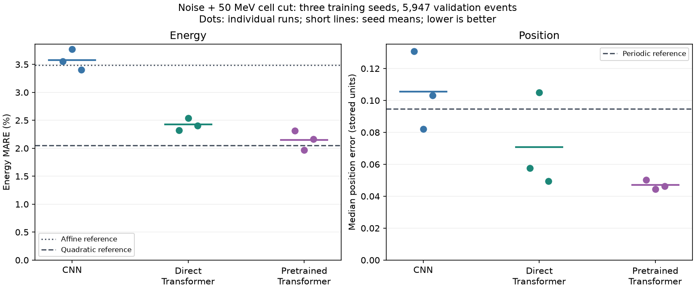
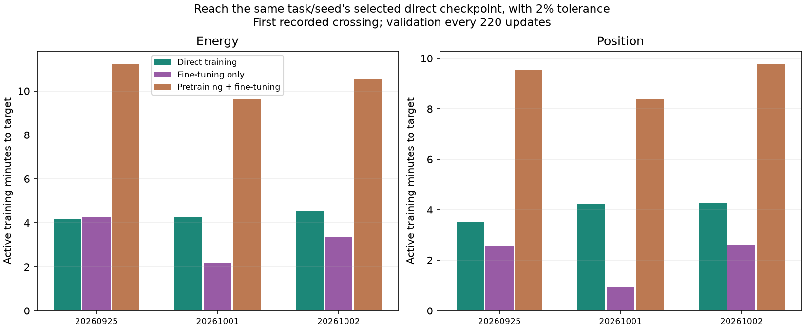

# Local reconstruction: GPU confirmation

**Masked pretraining improves position in all three training repetitions.** It also improves mean energy accuracy relative to the direct Transformer, but does not beat the stronger quadratic energy reference on average. The extra pretraining does not pay back as a total training-time saving for these two tasks.

These are **validation results**, following earlier methodology selection on the same validation set. The test was still reserved at this review. The subsequent [final evaluation](../final/README.md) now reports the final scientific outcomes.

## What ran

The [fixed protocol](../../docs/methodology.md) used 28,118 training events and 5,947 validation events. Each model receives a measured-maximum 7 x 7 window, linear train-only scaling and geometry, without a calibrated reference prediction. The primary readout adds the specified measurement noise and a 50 MeV cell cut. Clean and noise-only readouts are controls. Low-energy photons remain included.

All **29 phases** completed 4,400 updates: 20 direct task specialists, three shared masked pretrainings and six fine-tunings. For each seed, the same pretrained encoder was copied into the energy and position specialists, then fully fine-tuned separately. Transfer identities agree in summaries and checkpoint manifests. The 50% mask ratio was retained by the train-only audit; it checks measured positives, including noise, and does not guarantee that clean shower signal is always visible.

## Accuracy: where learning helps

Lower is better. Neural entries are the **mean of three separately evaluated scores**, with the observed minimum and maximum in brackets, not an ensemble or confidence interval. Energy MARE averages absolute fractional errors; position averages each run's median distance in stored coordinate units, not centimeters.

| Estimator | Energy MARE (%) | Median position error |
| --- | ---: | ---: |
| Affine energy / periodic position reference | 3.490 | 0.09460 |
| Quadratic energy reference | **2.051** | n/a |
| CNN specialists | 3.576 [3.401, 3.771] | 0.10544 [0.08220, 0.13089] |
| Direct Transformer specialists | 2.424 [2.323, 2.543] | 0.07076 [0.04952, 0.10504] |
| Pretrained Transformer specialists | 2.150 [1.970, 2.316] | **0.04704 [0.04453, 0.05031]** |

The pretrained position error is **33.5% lower than the direct Transformer's mean** and **50.3% lower than the periodic reference**. All three paired runs improve; one weak direct seed accounts for much of the mean gain. The observed position spread narrows, but three seeds do not establish general training stability.

For energy the mean improvement over the direct Transformer is **11.3%**. The first seed is effectively tied (2.323% versus 2.316%); only one of the three pretrained runs beats the quadratic reference. Energy seed dispersion does not shrink. This is a useful position result, not uniform neural superiority.

Two additional noise draws reuse the same events, selected checkpoints and calibrations. Position improves in all nine paired comparisons; energy in eight of nine. Mean rankings remain the same on every draw. These are three training repetitions with repeated measurements, not nine independent trainings.

## What noise and the cut change

These controls use the same training seed, 20260925. Pretraining was tested only in the primary noise-plus-cut condition.

| Readout | Direct Transformer energy (%) | Quadratic energy (%) | Direct Transformer position | Periodic position |
| --- | ---: | ---: | ---: | ---: |
| Clean | 1.173 | 0.583 | 0.03919 | 0.03415 |
| Noise | 2.577 | 2.164 | 0.05977 | 0.09311 |
| Noise + cell cut | 2.323 | 2.051 | 0.05772 | 0.09460 |

Noise makes absolute reconstruction worse. It changes which estimator is most useful: the Transformer loses to the position reference on clean measurements, but wins under either noisy readout. **The cut is not necessary for that gain.** Its extra position benefit is small here and has only a one-seed control. The readout remains an assumed simplified detector response, not validated digitization or evidence of performance on real collisions.

## Failures remain part of the result

The primary draw contains **10 / 5,947 (0.168%) position errors above 10 stored units**, shared by all local networks and position references. Recomputing the measured maxima from the input confirms the same ten misplaced anchors. Their true energies are 1.005-1.307 GeV: an extreme positive noise fluctuation can win over the weak shower, so the selected window misses the signal. The two additional draws contain seven and eight such events. Nothing is removed from the scores.

Ordinary tails improve: pretrained position p99 is 0.337-0.361 across seeds versus 0.704 for the periodic reference. But the catastrophic anchors dominate squared errors: position RMSE is about 1.76-1.77 for the pretrained runs and 1.768 for the reference. A halved median does not mean all failures are solved.

Some additional noise draws also yield nonpositive energy predictions from neural and affine estimators. They are counted, not silently clipped; the quadratic reference has none. Enforcing positivity or improving candidate finding would be later controlled changes, not retrospective repairs of this comparison.

The position advantage persists in all four energy bins and the defined index-boundary subset (710 events). Energy remains hardest below 10 GeV. These descriptive checks are in [review.json](review.json); index boundaries are not certified detector edges.

## Accuracy costs additional compute

Each task/seed target is the selected direct Transformer's error, with 2% relative tolerance. Times use the first observed crossing, sampled every 220 updates. Fine-tuning alone reaches the position target sooner on all seeds, but including pretraining is slower on every seed for both tasks. Targets differ by seed, so the weak direct run has an easier target. This is a retrospective comparison, not a tested early-stopping policy.

For the completed 4,400-update **two-task system**, count shared pretraining once:

| Training seed | Both direct specialists | Pretraining + both fine-tunings | Cost ratio |
| --- | ---: | ---: | ---: |
| 20260925 | 9.28 min | 16.42 min | 1.77x |
| 20261001 | 9.46 min | 17.04 min | 1.80x |
| 20261002 | 9.54 min | 16.69 min | 1.75x |

Do not add the pretraining-inclusive bars for the two tasks: that double-counts their shared pretraining. No longer direct-training control at equal **total** compute was run. These gains compare equal downstream updates with extra pretraining compute, not equal total budgets.

The complete study used **109.56 active training minutes + 0.97 selection minutes** on one Tesla T4 (110.53 minutes). This excludes setup, queues, checkpoint I/O, figures, final robustness predictions and interruption overhead. Runtime: Python 3.12.13, PyTorch 2.7.1+cu126, CUDA 12.6, deterministic float32 math attention. Maximum recorded PyTorch allocation was 97.33 MiB, not whole-process GPU memory. CNN and downstream Transformer allocate 105,849 and 101,065 parameters respectively; the inactive task head is excluded from active counts in the JSON.

The [primary-seed learning curves](learning.png) show validation versus active supervised time. Their fine-tuning curve excludes pretraining cost, unlike the inclusive comparison above.

## Next evaluation

These are validation results for the selected method. The subsequent [held-out evaluation](../final/README.md) is complete and provides the final conclusions. Execution and integrity details are grouped in [reproduction](../../docs/reproduce.md).
