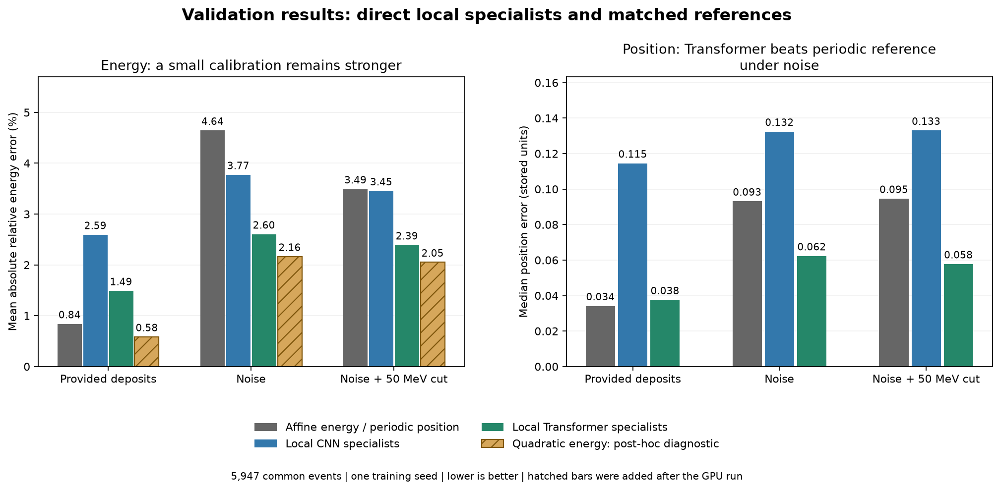

# Methodology decision review

**Exploratory review preceding the selected protocol.** The choices below now inform the [local confirmation](../../../docs/methodology.md), whose GPU and final held-out results are now complete. The numerical findings in this review remain exploratory.

Original recommendation: Use an observed 7 x 7 window and separate task training for the next direct CNN/Transformer comparison. Use noise plus a 50 MeV cut, following the published response model, as the main simulated measurement scenario, retaining clean and noise-only controls. One shared pretrained encoder would later initialize both task-specific fine-tunings.

The evidence supports a neural benefit for **position**, but does not establish that a neural network is the best energy estimator. A corrected small classical calibration currently reconstructs energy more accurately.

All scores use the same **5,947 validation events**, with **28,118 training events**. The complete matrix contains 22 new T4 trainings and 14 verified historical cases. Every training completed 4,400 updates. No reserved-test data were used. [Compact numerical evidence](evidence.json) retains all 36 configurations.

## What the experiments support

| Choice | Evidence | Recommended treatment |
| --- | --- | --- |
| Local input | The observed window retains a median 99.52% of the original deposited energy. Local Transformer specialists outperform the full-grid specialists in every readout condition. | Keep the 7 x 7 input centered on the measured maximum. This is an observed geometry choice, not a true-label crop. |
| Separate tasks | With noise plus cut, Transformer position error falls from 0.39694 in joint training to 0.05775 in position-only training. Energy improves slightly, from 2.463% to 2.388%. | Keep specialists primarily for position and for a matched study of transfer to each task. Do not claim that separation universally improves energy. |
| Noise and cut | The measurement scenario has a published motivation; it changes the reconstruction problem. Networks and references see the same measurements and calibrations use train only. | Keep noise plus cut as the main candidate scenario; clean and signed-noise cases remain controls. Do not select noise strength to maximize neural advantage. |
| Direct prediction | Networks use the observed crystals and geometry, without a calibrated energy or barycenter prediction as input. | Keep direct models for the next study. The earlier correction models remain a documented previous experiment. |
| References | Affine energy and periodic position are useful competitors, but a repaired quadratic energy control is stronger. | Retain all three, clearly distinguishing the post-hoc diagnostic until its specification is frozen. |

Full and local pipelines also differ in spatial processing and tokenization. The local Transformer uses 49 crystal tokens, the full version 102 patch tokens. For the CNN, the input transform also differs. This is not a pure crop ablation or a conclusion about the best possible global architecture. Specialist losses have weight one, versus one half per task in joint training; this comparison does not isolate task interference.

## The main candidate condition: noise plus cut

Lower errors are better. Position uses stored coordinate units, not centimeters.

| Method | Energy MARE (%) | Energy MAE (GeV) | Position median |
| --- | ---: | ---: | ---: |
| Affine energy / periodic barycenter | 3.490 | 0.888 | 0.09460 |
| Local CNN specialists | 3.453 | 1.291 | 0.13301 |
| Local Transformer specialists | 2.388 | 0.821 | 0.05775 |
| Quadratic energy, without ridge (post hoc) | 2.051 | 0.626 | Not applicable |

The Transformer reduces median position error by **39.0%** relative to the periodic reference. Its energy error is lower than the affine sum calibration, but higher than the corrected quadratic calibration. The CNN is approximately four times faster to train here, but less accurate: its two specialists cost 180.7 seconds of training plus validation, versus 721.9 seconds for the Transformer pair. The joint Transformer costs 358.6 seconds. Inference latency has not been measured.

## Why the energy-control result changed

The original quadratic control had 17.56% energy MARE under noise plus cut, including similarly poor training error. Its fixed ridge penalty strongly shrunk coefficients expressed in GeV while the fitting error was relative.

A single post-hoc diagnostic retained the same seven observed features, the same quadratic basis and train standardization. It removed that penalty and solved the relative least-squares problem by SVD. This handles redundant columns without inverting a singular normal-equation matrix. No validation sweep or neural retraining was performed. The original result remains in the evidence.

| Condition | Original ridge MARE (%) | Without ridge MARE (%) | Transformer energy specialist (%) |
| --- | ---: | ---: | ---: |
| Provided deposits | 18.041 | 0.583 | 1.488 |
| Noise | 17.686 | 2.164 | 2.602 |
| Noise plus cut | 17.563 | 2.051 | 2.388 |

Training and validation improve together. With noise plus cut, the corrected calibration also remains better on both additional noise realizations: its MARE spans 2.017-2.142%, versus 2.405-2.441% for the Transformer on those same realizations. This diagnostic is evidence against a broad neural superiority claim, not an independently confirmed final model. Its specification was included in the subsequent frozen comparison; the original exploratory row remains in the evidence.

The archived calibration diagnostic reproduced the original ridge metrics before calculating the unregularized result. Its prediction files contain energy only; the unused position columns are explicitly zero placeholders, not position estimates.

## Robustness, tails and physical interpretation

The local Transformer position median remains 0.05775-0.05837 across three fixed validation noise realizations. On the primary realization, its 95th and 99th percentiles are 0.20945 and 0.39013, compared with 0.38112 and 0.70368 for the periodic reference. The gain appears in all four incident-energy bins.

However, **10/5,947 events (0.168%)** have position errors above ten stored units. They have incident energies between 1.005 and 1.307 GeV and a noise-displaced observed maximum. The same ten events fail for the periodic local reference. They remain included in every reported score. The full-grid Transformer has a smaller worst-case error but a much larger 99th percentile, 10.67046, and 67 errors above ten units. Report both typical errors and failure rates.

The 95% paired event-bootstrap interval for the position-median difference (Transformer minus periodic) is [-0.03897, -0.03491]. For energy MARE relative to the corrected quadratic control it is [+0.277, +0.403] percentage points. These 1,000-resample intervals (seed 20260927) condition on the selected models. They do not measure training-seed variation or correct for exploratory selection.

The measurement model follows [DeepCluster, section 3.2](https://link.springer.com/article/10.1140/epjc/s10052-024-12978-1) and [ClusTEX, sections 3.4-3.5](https://arxiv.org/html/2603.18172v2#S3.SS4). It is a simplified detector response, not full digitization or real CMS data. A single maximum and one window also simplify the published candidate-building procedures. Their reconstruction references are more elaborate than our affine sum; DeepCluster includes a multivariate energy correction for PFClustering.

The 50 MeV cut is below the 167 MeV electronic noise scale. Discarding negative measurements creates a positive background in empty cells. The recorded value 151.67 GeV is the **mean per-event sum over all truly empty cells**, not a mean per crystal; the stored diagnostic field name is abbreviated ambiguously. This is a measurement bias, not extra physical deposited energy. References therefore also use calibrated local windows, not only a weak global sum.

The cut removes signal too: surviving cells retain a median 98.14% of the true clean deposited energy, or 93.75% below 10 GeV. Only ten noisy windows actually cross the grid boundary, so general robustness at physical detector edges is not established. Training uses a fixed noise realization; the repeat check changes validation noise only.

## Subsequent decision

The local specialist protocol was selected from these validation experiments and then frozen for [three-seed confirmation](../../confirmation/README.md) and [held-out evaluation](../../final/README.md). No test results informed the choices in this review. The compact [evidence file](evidence.json) preserves the original and repaired reference scores.
