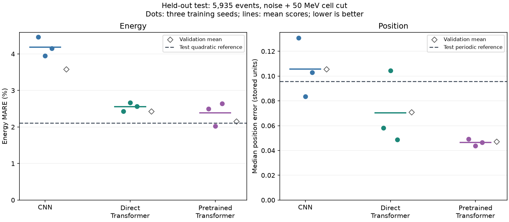
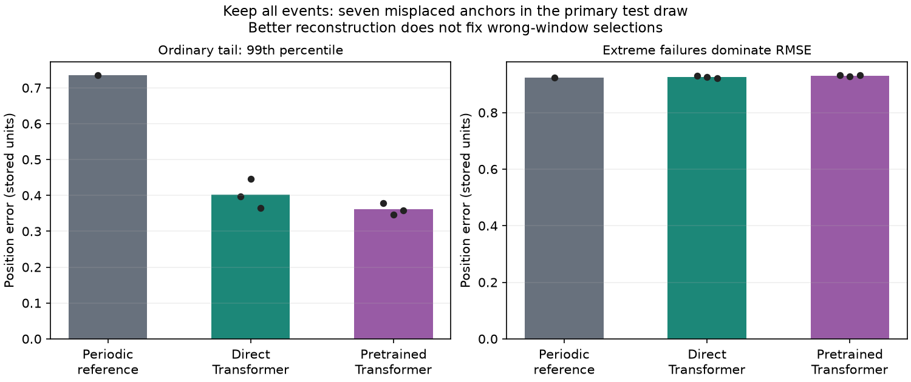
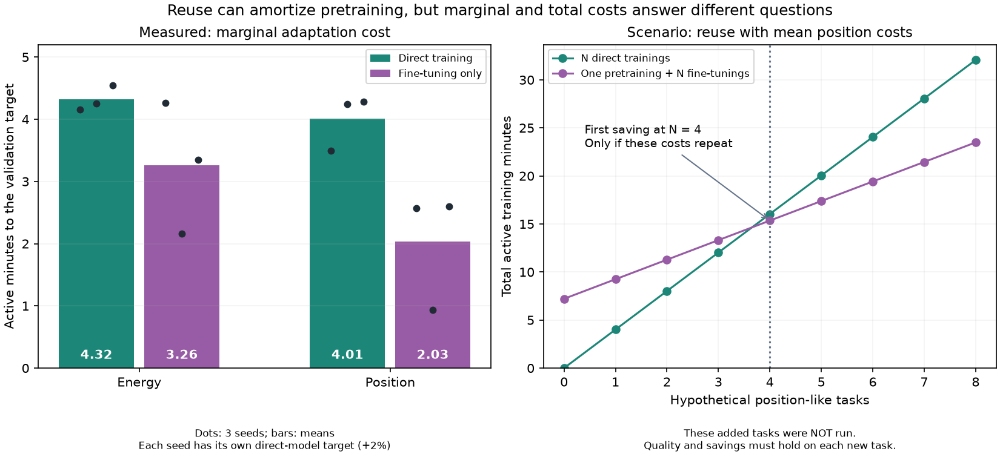

# Final evaluation: a reusable encoder helps position reconstruction

**The held-out test confirms the position benefit of masked pretraining.** The pretrained Transformer reduces mean median-position error by 34.1% against direct training and 51.5% against the periodic reference. Energy gains depend on the metric: the quadratic reference remains better on both mean and median error averaged across training seeds.

## What was frozen and evaluated

The [specification](../../configs/final_evaluation.json) was frozen before opening the **5,935-event test**: 26 validation-selected specialists, calibrations, preprocessing, three new noise seeds and bootstrap settings. Nothing was adjusted using test results.

The [methodology](../../docs/methodology.md) uses the observed-maximum 7 x 7 window, separate energy and position specialists, and one shared masked pretraining per training seed followed by two fine-tunings. The primary condition adds Gaussian measurement noise and a 50 MeV cell threshold. Inputs contain deposits and geometry, without a calibrated reference prediction.

## Test accuracy



Lower is better. Neural entries are means of three scores, followed by their observed range, **not ensembles or confidence intervals**. Energy MARE is mean absolute fractional error; position uses stored coordinate units, not centimeters. This table uses the first frozen test-noise draw.

| Estimator | Energy MARE (%) | Median position error |
| --- | ---: | ---: |
| Affine energy / periodic position reference | 3.717 | 0.09576 |
| Quadratic energy reference | **2.104** | n/a |
| CNN specialists | 4.188 [3.945, 4.465] | 0.10577 [0.08363, 0.13083] |
| Direct Transformer specialists | 2.554 [2.432, 2.665] | 0.07040 [0.04865, 0.10434] |
| Pretrained Transformer specialists | 2.389 [2.025, 2.642] | **0.04643 [0.04372, 0.04917]** |

Position improves against direct training on all three seeds. For each fixed seed, the paired 95% bootstrap interval favors fine-tuning against both direct training and the periodic reference. One weak direct seed contributes substantially to the mean improvement; three seeds do not establish general training stability.

Energy improves clearly against direct training only for seed 20261001; the other point estimates worsen slightly and their intervals include zero. Against the quadratic reference, one pretrained seed improves and two worsen. The average advantage over direct training weakens from [validation](../confirmation/README.md).

Bootstrap resamples **paired events for fixed models**, with 1,000 replicates on the primary draw. These are conditional event intervals, not training-seed uncertainty or simultaneous confidence intervals. Two additional noise draws reuse the same events and weights: position improves in all nine paired comparisons, energy in seven. These are not nine independent trainings or datasets.

## Physical interpretation and failures

The one-seed controls separate the effects of noise and the cell cut:

| Readout | Direct energy (%) | Quadratic energy (%) | Direct position | Periodic position |
| --- | ---: | ---: | ---: | ---: |
| Clean | 1.215 | 0.595 | 0.03906 | 0.03353 |
| Noise | 2.675 | 2.292 | 0.06133 | 0.09441 |
| Noise + cell cut | 2.432 | 2.104 | 0.05822 | 0.09576 |

Noise worsens absolute reconstruction but changes the relative value of the estimators: direct neural position loses on clean data and wins under both noisy readouts. The threshold is **not necessary** for that position advantage. It removes measured cell deposits below 50 MeV, not low-energy incident photons. These controls do not validate the assumed noise as full detector digitization or establish performance on real collisions.



Left: the 99th percentile is the position error below which 99% of events fall. Right: root mean squared error (RMSE) squares errors before averaging, making it sensitive to a few very large failures. Bars average the three trained-model scores and dots show individual seeds; the reference has no training-seed variation. These are aggregate error summaries, not images of individual showers.

Seven of 5,935 primary-draw events (0.118%) have misplaced anchors and position errors above 10 stored units. Their true energies are 1.059-1.300 GeV: a large positive noise fluctuation can move the selected window away from a weak shower. The repeat draws contain three and four misplaced anchors. All events remain in the metrics.

Pretrained position p99 improves to 0.347-0.379 versus 0.735 for the periodic reference. Yet its RMSE is 0.928-0.932 versus 0.923: rare large failures dominate squared error. Better reconstruction within the selected window does not fix cases where that window misses the shower. Nonpositive energy predictions are likewise counted without clipping. Fixed energy-bin, index-boundary and tail results are retained in [results.json](results.json).


## Supplementary energy median analysis

This descriptive analysis was added after the test evaluation, on 29 September 2026, to check whether the energy conclusion depends on using a mean. It reuses all 5,935 events and the saved predictions, with no training, refitting, clipping or model selection. The original primary metric remains mean absolute relative error (MARE). The additional metric is `100 * median(abs((prediction - truth) / truth))`, not a signed-error median or a median energy.

| Estimator | Mean absolute relative error (%) | Median absolute relative error (%) |
| --- | ---: | ---: |
| Affine calibration | 3.717 | 1.611 |
| Quadratic calibration | 2.104 | 1.115 |
| CNN | 4.188 | 2.669 |
| Direct Transformer | 2.554 | 1.454 |
| Pretrained Transformer | 2.389 | 1.261 |

Neural entries average three separately calculated model scores. The main noise-plus-cut condition and first test-noise draw are unchanged.

| Training seed | Direct median (%) | Pretrained median (%) | Relative median reduction |
| --- | ---: | ---: | ---: |
| 20260925 | 1.416 | 1.354 | 4.4% |
| 20261001 | 1.519 | 1.128 | 25.8% |
| 20261002 | 1.426 | 1.301 | 8.8% |

Pretraining improves the energy median on all three training seeds, although mean error improves on only one. This supports a benefit for typical relative error; it does not establish an improvement across the whole error distribution. The quadratic reference has a lower median than all three neural runs on the primary draw. No additional significance claim is made from these point estimates.

| Test-noise draw | Quadratic median (%) | Direct median (%) | Pretrained median (%) |
| --- | ---: | ---: | ---: |
| 20261010 | 1.115 | 1.454 | 1.261 |
| 20261011 | 1.111 | 1.451 | 1.253 |
| 20261012 | 1.133 | 1.461 | 1.279 |

The median improves against direct training in all nine paired seed/noise comparisons; the quadratic reference remains best in each draw when comparing seed-average scores. These draws reuse the same events and models, so they are not nine independent trainings. Clean and noise-only controls were also checked: the quadratic median remains below the direct CNN and Transformer medians there. No pretrained controls exist for those regimes.

Reproduce this supplementary calculation with the existing final-evaluation run directory (containing `summary.json` and `predictions/`):

```bash
uv run --locked --extra cpu python scripts/review_final.py \
  --run "$FINAL_RUN" --freeze configs/final_evaluation.json --energy-median-only
```

The command prints all 56 energy-bearing records, including controls and references, after checking file hashes, event alignment and the original metrics. It leaves the frozen results and model-selection protocol unchanged.

## Adaptation time and reuse

**With an encoder already available, fine-tuning reaches the direct position model's validation level sooner on all three seeds.** Initial pretraining is a separate, one-off cost. Reuse can pay that cost back if enough useful tasks retain both the accuracy and the adaptation-time advantage.



### Measured marginal time

Times below are active training to the first observed validation crossing of the same task/seed direct model's selected error, allowing 2% relative tolerance. They exclude pretraining, validation, I/O and setup. The target is sampled every 220 updates. The comparison uses the recorded learning curves retrospectively; it is not a tested early-stopping policy.

| Seed | Task | Direct (min) | Fine-tuning (min) | Time saving |
| --- | --- | ---: | ---: | ---: |
| 20260925 | Energy | 4.15 | 4.26 | -2.7% |
| 20260925 | Position | 3.50 | 2.57 | 26.6% |
| 20261001 | Energy | 4.25 | 2.16 | 49.1% |
| 20261001 | Position | 4.25 | 0.94 | 77.9% |
| 20261002 | Energy | 4.55 | 3.34 | 26.5% |
| 20261002 | Position | 4.28 | 2.60 | 39.3% |
| Seed mean | Energy | 4.32 | 3.26 | 24.6% |
| Seed mean | Position | 4.01 | 2.03 | 49.2% |

These means pool timings, not predictions. Targets differ by seed: the weakest direct position run sets the easiest target and contributes the largest saving. Three repetitions do not establish a general acceleration factor.

Pretraining separately costs **7.21 active minutes on average** (one Tesla T4). At the actual fixed budget of 4,400 updates, both approaches completed their full schedules. No early finish was exercised: the completed fine-tunings do not themselves demonstrate a reduced training bill. Faster target attainment would need a prospective stopping rule to realize that saving in a new run. The full two-task schedules averaged 9.43 min direct versus 9.50 min fine-tuning alone (approximately equal); pretraining is additional.

### When would reuse pay back?

Let P be pretraining time, D_i direct-training time and F_i fine-tuning time for task i at an acceptable, comparable quality level. Count pretraining once:

```text
Direct cost:       D_1 + D_2 + ... + D_N
Reuse cost:    P + F_1 + F_2 + ... + F_N
Reuse is faster when sum(D_i - F_i) > P.
```

If every added task repeats the same positive saving Delta = D - F, the first integer giving a strict saving is floor(P / Delta) + 1. If Delta is zero or negative, repeating that task profile never pays back the initial cost.

| Hypothetical task profile | Using mean times | Per-seed scenarios |
| --- | --- | --- |
| Energy-like costs | 7 tasks | no payback, 4 tasks, 6 tasks |
| Position-like costs | 4 tasks | 8 tasks, 3 tasks, 5 tasks |
| Balanced energy/position pairs | 3 pairs = 6 tasks | 18 tasks, 4 tasks, 6 tasks |

Per-seed order is 20260925, 20261001, 20261002. These are **conditional cost scenarios, not counts of demonstrated useful tasks or uncertainty intervals**. The two tasks actually studied do not pay back pretraining even at their first recorded target crossings. Repeating seeds does not create new tasks. The position-cost example crosses at four tasks using means, but the three seed-based scenarios span three to eight tasks. The exact break-even count for genuinely new tasks cannot be measured from this two-task study.

### Quality is a separate requirement

The strongest validation evidence is position: fine-tuning improves all three paired direct results and the periodic reference. Energy improves on average against direct training, but the quadratic reference remains better on average. A timing target based on the direct Transformer is not a guarantee of beating the best classical estimator, nor of reaching the best fine-tuned accuracy. The full-budget accuracy gains and the earlier target-crossing times describe different checkpoints; they must not be claimed simultaneously at the shorter time.

A shared pretrained encoder can therefore have two distinct benefits: better quality on a demonstrated task and cheaper adaptation on future suitable tasks. Only the former and retrospective adaptation times are measured here. General reuse, new task quality and a deployment stopping rule remain untested. This small single-detector study does not establish a universal foundation model.


## Reproduce

Installation, software checks, fixed inference and Docker comparison are described in the single [reproduction guide](../../docs/reproduce.md). Exact aggregate values remain in [results.json](results.json) and the validation-based timing calculation in [amortization.json](amortization.json). No models or reporting rules were changed after viewing test results.
